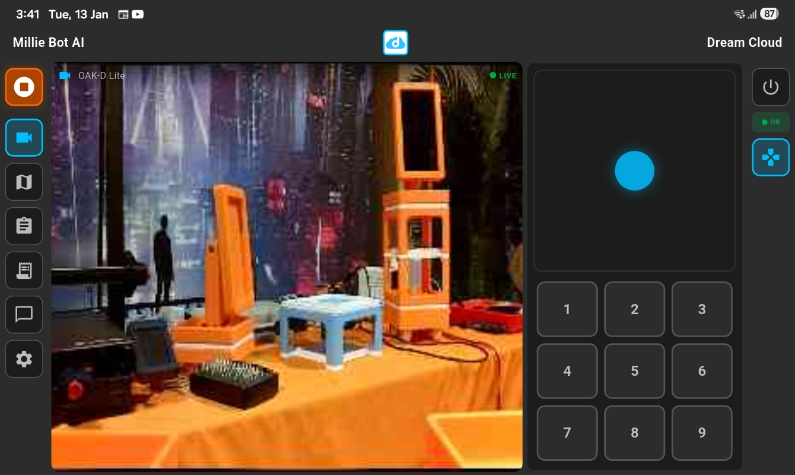
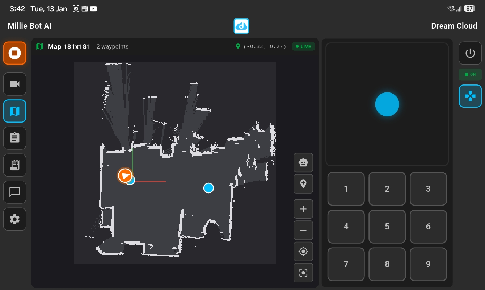
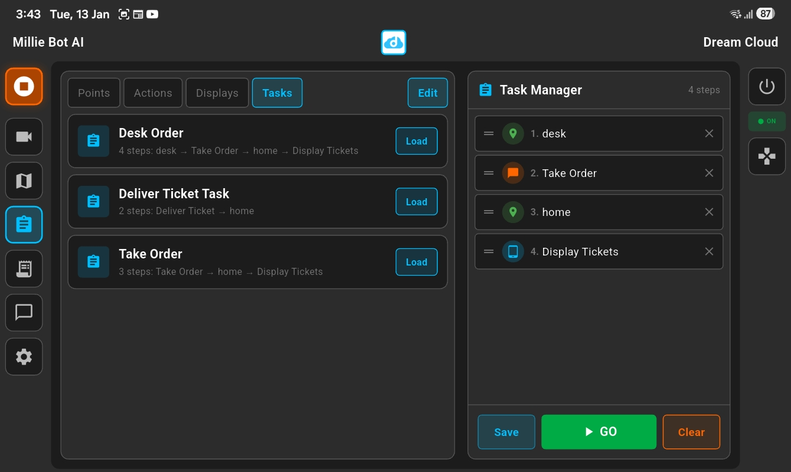
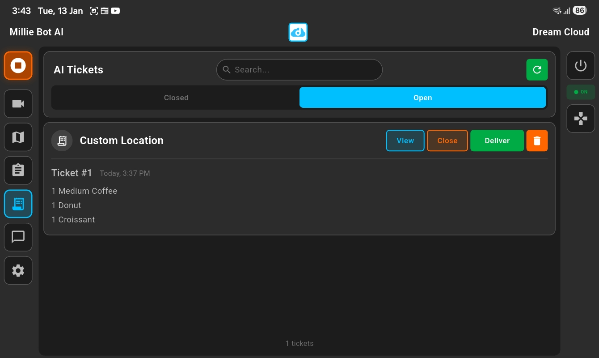
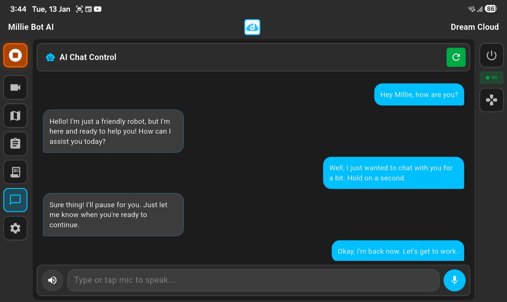
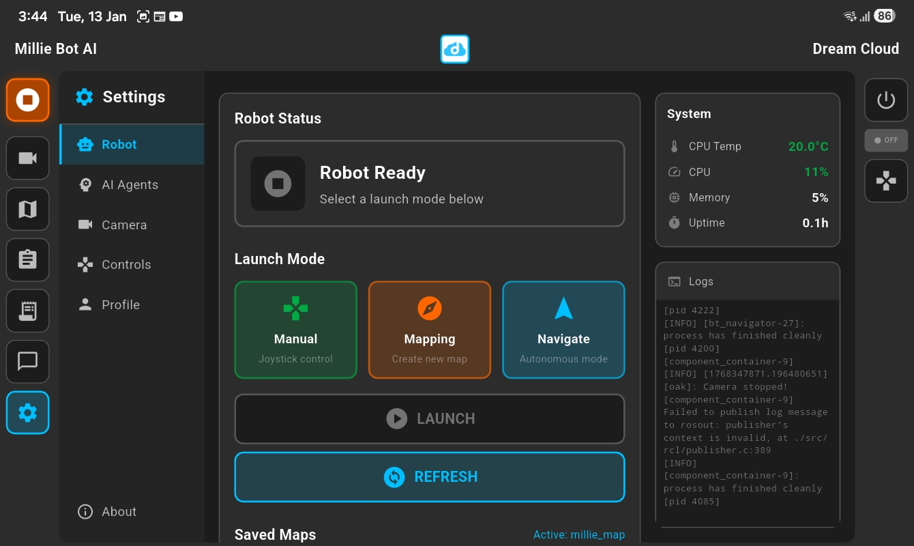

# Millie Control

A cross-platform Flutter app for controlling ROS-based robots with AI-powered voice interaction.


## Screenshots

### Camera & Joystick


### Map & Navigation


### Task Manager


### Tickets


### AI Chat


### Settings


## Features

- **Live Video Streaming** — MJPEG camera feed from the robot
- **Virtual Joystick** — Manual robot control with on-screen joystick
- **Map View** — Real-time navigation and mapping visualization
- **AI Chatbot** — Conversational robot control powered by OpenAI
  - Text and voice input (Whisper speech-to-text)
  - Text-to-speech responses
  - Function calling for robot commands
- **Locations** — Save and navigate to waypoints
- **Tickets** — Task/job management system
- **Robot Controls** — E-stop, shutdown, and reboot commands
- **Responsive Layout** — Optimized for both landscape and portrait orientations

## Platforms

Works on Android, iOS, Linux, macOS, Windows, and Web.

## Prerequisites

- [Flutter SDK](https://docs.flutter.dev/get-started/install) 3.9+
- A ROS robot with:
  - [rosbridge_server](http://wiki.ros.org/rosbridge_suite) running on port `9090`
  - MJPEG video stream available
  - Boot server API (optional, for power controls)
- OpenAI API key (for AI chat features)

## Setup

### 1. Clone the repository

```bash
git clone https://github.com/DreamCloudClub/millie_control.git
cd millie_control
```

### 2. Install dependencies

```bash
flutter pub get
```

### 3. Configure environment

Copy the example environment file and add your API key:

```bash
cp .env.example .env
```

Edit `.env` and add your OpenAI API key:

```
OPENAI_API_KEY=sk-your-api-key-here
```

> Get your API key at [platform.openai.com/api-keys](https://platform.openai.com/api-keys)

### 4. Configure robot connection

Update the robot IP address in `lib/pages/home_page.dart`:

```dart
robotApi = RobotApi("http://YOUR_ROBOT_IP:5050");
rosBridge = RosBridge("ws://YOUR_ROBOT_IP:9090");
```

### 5. Run the app

```bash
flutter run
```

## Project Structure

```
lib/
├── main.dart              # App entry point
├── models/                # Data models
├── pages/                 # Full-screen views
│   ├── home_page.dart     # Main dashboard
│   ├── settings_page.dart
│   ├── locations_page.dart
│   └── tickets_page.dart
├── services/              # External service integrations
│   ├── openai_service.dart
│   ├── location_service.dart
│   └── navigation_tools.dart
├── utils/                 # Utilities and constants
│   ├── constants.dart
│   ├── robot_api.dart
│   └── rosbridge.dart
└── widgets/               # Reusable UI components
    ├── video_panel.dart
    ├── joystick_panel.dart
    ├── map_panel.dart
    ├── chatbot_panel.dart
    └── ...
```

## License

MIT License — see [LICENSE](LICENSE) for details.
